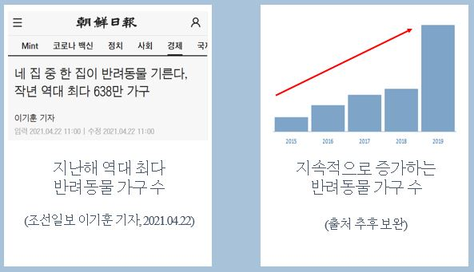
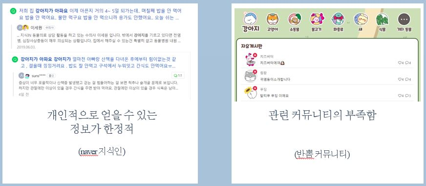
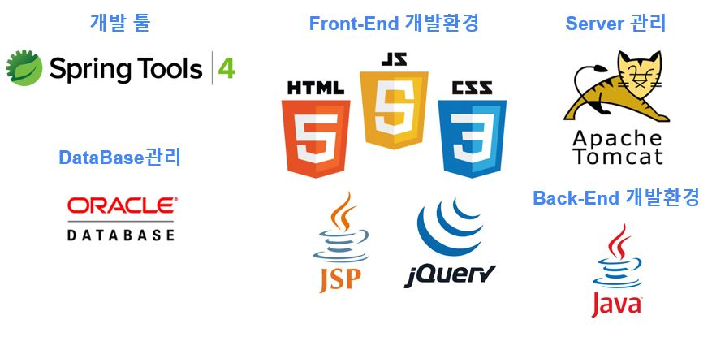
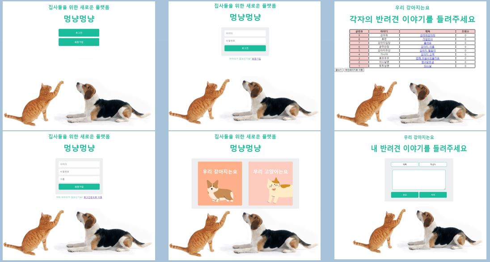

# 전국의 집사들을 위한 새로운 플랫폼 - 멍냥멍냥

> 삼성 멀티캠퍼스 온오프 연계 AI활용 지능형 서비스 개발과정 세미프로젝트 
>
> *Project* period 2020.04.21~2020.04.23

## 개요

* 반려동물과 함께하는 가구수는 지속적으로 증가하는 추세
  * 최근 역대 최다 반려동물 가구수 돌파

* 반려동물 가구수가 증가한 만큼 각종 반려동물 관련 사건, 사고가 증가하고 유기되는 반려동물 또한 증가

* 반려동물을 키우는데 있어 기본적인 소양 부족으로 주변에 민폐가 되거나 교육 부족으로 인한 갈등 사례 증가

* 반려동물 관련 정보는 한정적, 관련 커뮤니티 및 전문적인 플랫폼이 부족한 현상을 해소하기 위함

## 프로젝트 주제 및 내용

* 멍냥멍냥은 원활화된 게시판에 다양한 반려동물 가구들이 정보를 공유하고, 일상을 나누며 더 나은 반려생활을 하는 것을 가장 우선시함

* 타겟 고객이 정해져 있는 만큼 다양한 연령대의 고객층을 위해 직관적인 UI를 디자인하여 누구나 쉽게 접근할 수 있도록 함

## 사용 기술 스택

## 주요 기능

* 누구나 쉽게 이해, 사용할 수 있는 간단한 UI/UX디자인을 통한 접근성을 확대
* 로그인 및 회원가입
* MVC 방식을 선정하여 유지보수 및 재사용성에 강점
* 게시판 CRUD기능

## 보완점 및 제안점

* 더 나은 UI/UX 디자인 추구

* 페이징 처리

* 지도 api연동을 통한 동물병원 및 산책로 등의 정보 표시

* 쪽지 기능 추가

* 게시글에 사진첨부 기능 추가

* 반려동물 일정 저장을 위한 캘린더 기능 추가

* Hot 게시글 기능 추가

* 개인 반려동물 프로필 기능 추가

* Oracle대신 MySQL등의 DB변경 및 서버 구축

* 커뮤니티 특성상 웹 대신 언제나 접속 가능한 모바일 어플리케이션으로 출시

  

## 프로젝트 후기

정말 짧은 프로젝트 기간 동안 주제 선정, 설계 및 구현 및 UI/UX 디자인을 혼자 진행하다 보니 기능적으로나 디자인적으로나 부족한 모습을 보여 아쉽다.

결과물의 목표가 단순 게시판 기능을 구현하는것이 아닌 특정 타겟을 위한 하나의 커뮤니티를 제작하는 것이었기에 부족한 시간 내 구현이 불가능하여 단순하게 게시판 기능만 하는 아주 간단한 프로젝트가 되었다. 

하지만 구현 전 현재 사회적 이슈와 그에 따른 문제점에 대처하기 위한 필요성 높은 어플리케이션을 제시하였다는 점과 명확한 타겟 고객층이 있기에 그에 따른 요구사항을 분석한 점, 처음으로 풀스택 개발을 경험한 부분이 만족스러웠다.

